autoscale: true
theme: Plain Jane, 3
code: Hack
background-color: #00374A
footer:asdf
footer-style: #00374A, text-scale(2.6)
header: alignment(left)

[.header: alignment(center)]

# implementing code coverage
#### with
# `-toolexec`
### Ehden Sinai
### 

---

[.header: alignment(center)]
[.footer-style: line-height: 10]

# implementing code coverage
#### with
# `-toolexec`
### Ehden Sinai
### 

^ Hi, I'm Ehden, I write stuff in Go at Contrast Security

^ This talk is about code coverage

^ I'm gonna start by walking through how Go’s built-in cover flag works

^ and then I’ll talk about how we can build out some of this functionality ourselves

^ Now to be clear, I'm not trying to replace Go's built-in coverage tool.

^ Implementing our own is just a learning exercise.

^ Go's tool is better than mine in every way so if you need code coverage, just use that.

---

[.column]

```go
package main

import (
	"fmt"
	"log"
	"os"
	"strconv"
)

func main() {
	n, err := strconv.Atoi(os.Args[1])
	if err != nil {
		log.Fatal("🤬")
	}

	for i := 1; i <= n; i++ {
		fmt.Println(fizzbuzz(i))
	}
}

func fizzbuzz(n int) string {
	switch {
	case n%15 == 0:
		return "fizzbuzz"
	case n%5 == 0:
		return "buzz"
	case n%3 == 0:
		return "fizz"
	default:
		return strconv.Itoa(n)
	}
}​
```

^ so let's get started

^ we have a little example program

---

[.column]

```go
package main

import (
	"fmt"
	"log"
	"os"
	"strconv"
)

func main() {
	n, err := strconv.Atoi(os.Args[1])
	if err != nil {
		log.Fatal("🤬")
	}

	for i := 1; i <= n; i++ {
		fmt.Println(fizzbuzz(i))
	}
}

func fizzbuzz(n int) string {
	switch {
	case n%15 == 0:
		return "fizzbuzz"
	case n%5 == 0:
		return "buzz"
	case n%3 == 0:
		return "fizz"
	default:
		return strconv.Itoa(n)
	}
}​
```

[.column]
[.autoscale: false]

### ​

### ​

`go build -cover`

`go run -cover`

`go test -cover`

`go list -export -cover`

^ and there are a bunch of ways you can tell go to build this program

^ regardless of how you do it, go says "cool, i'm gonna build this instead"

^ [35 seconds]

---

```go
package main; import _ "runtime/coverage"

import (
	"fmt"
	"log"
	"os"
	"strconv"
)

func main() {goCover_4bac6d588efe__0[0] = 4 ; goCover_4bac6d588efe__0[1] = goCover_4bac6d588efe_P ; goCover_4bac6d588efe__0[2] = 0 ; goCover_4bac6d588efe__0[3] = 1;
	n, err := strconv.Atoi(os.Args[1])
	if err != nil {goCover_4bac6d588efe__0[5] = 1;
		log.Fatal("🤬")
	}

	goCover_4bac6d588efe__0[4] = 1;for i := 1; i <= n; i++ {goCover_4bac6d588efe__0[6] = 1;
		fmt.Println(fizzbuzz(i))
	}
}

func fizzbuzz(n int) string {goCover_4bac6d588efe__1[0] = 5 ; goCover_4bac6d588efe__1[1] = goCover_4bac6d588efe_P ; goCover_4bac6d588efe__1[2] = 1 ; goCover_4bac6d588efe__1[3] = 1;
	switch {
	case n%15 == 0:goCover_4bac6d588efe__1[4] = 1;
		return "fizzbuzz"
	case n%5 == 0:goCover_4bac6d588efe__1[5] = 1;
		return "buzz"
	case n%3 == 0:goCover_4bac6d588efe__1[6] = 1;
		return "fizz"
	default:goCover_4bac6d588efe__1[7] = 1;
		return strconv.Itoa(n)
	}
}​
```

^ this is generated right before compilation so it's not really meant for our eyes,

^ but I promise not as complicated as it looks.

---

[.code-highlight: 12,23,25,27,29]
```go
package main; import _ "runtime/coverage"

import (
	"fmt"
	"log"
	"os"
	"strconv"
)

func main() {goCover_4bac6d588efe__0[0] = 4 ; goCover_4bac6d588efe__0[1] = goCover_4bac6d588efe_P ; goCover_4bac6d588efe__0[2] = 0 ; goCover_4bac6d588efe__0[3] = 1;
	n, err := strconv.Atoi(os.Args[1])
	if err != nil {goCover_4bac6d588efe__0[5] = 1;
		log.Fatal("🤬")
	}

	goCover_4bac6d588efe__0[4] = 1;for i := 1; i <= n; i++ {goCover_4bac6d588efe__0[6] = 1;
		fmt.Println(fizzbuzz(i))
	}
}

func fizzbuzz(n int) string {goCover_4bac6d588efe__1[0] = 5 ; goCover_4bac6d588efe__1[1] = goCover_4bac6d588efe_P ; goCover_4bac6d588efe__1[2] = 1 ; goCover_4bac6d588efe__1[3] = 1;
	switch {
	case n%15 == 0:goCover_4bac6d588efe__1[4] = 1;
		return "fizzbuzz"
	case n%5 == 0:goCover_4bac6d588efe__1[5] = 1;
		return "buzz"
	case n%3 == 0:goCover_4bac6d588efe__1[6] = 1;
		return "fizz"
	default:goCover_4bac6d588efe__1[7] = 1;
		return strconv.Itoa(n)
	}
}​
```

^ blocks of statements separated by control flow operators or functions are given variables

^ and those variables are set to 1 when those blocks run.

---

```go
package main

var goCover_4bac6d588efe_P uint32
var goCover_4bac6d588efe__0 [7]uint32
var goCover_4bac6d588efe__1 [8]uint32
var goCover_4bac6d588efe_M = [...]byte{
 0xab, 0x0, 0x0, 0x0, 0x2, 0x0, 0x0, 0x0, 0x1,
 0x0, 0x0, 0x0, 0x1, 0x0, 0x0, 0x0, 0xa6,
 0xab, 0xad, 0xa7, 0xfd, 0x97, 0xae, 0xbb, 0x23,
 0xee, 0x28, 0x5f, 0x36, 0x67, 0x91, 0x7f, 0x0,
 0x0, 0x0, 0x0, 0x5, 0x0, 0x0, 0x0, 0x2,
 0x0, 0x0, 0x0, 0x76, 0x0, 0x0, 0x0, 0x8e,
 0x0, 0x0, 0x0, 0x5, 0x0, 0x12, 0x65, 0x68,
 0x64, 0x65, 0x6e, 0x2e, 0x6e, 0x65, 0x74, 0x2f,
 0x66, 0x69, 0x7a, 0x7a, 0x62, 0x75, 0x7a, 0x7a,
 0x4, 0x6d, 0x61, 0x69, 0x6e, 0x1e, 0x65, 0x68,
 0x64, 0x65, 0x6e, 0x2e, 0x6e, 0x65, 0x74, 0x2f,
 0x66, 0x69, 0x7a, 0x7a, 0x62, 0x75, 0x7a, 0x7a,
 0x2f, 0x66, 0x69, 0x7a, 0x7a, 0x62, 0x75, 0x7a,
 0x7a, 0x2e, 0x67, 0x6f, 0x8, 0x66, 0x69, 0x7a,
 0x7a, 0x62, 0x75, 0x7a, 0x7a, 0x4, 0x2, 0x3,
 0xa, 0xd, 0xc, 0x10, 0x2, 0x10, 0x2, 0x10,
 0x1a, 0x1, 0xc, 0x10, 0xe, 0x3, 0x1, 0x10,
 0x1a, 0x12, 0x3, 0x1, 0x0, 0x5, 0x4, 0x3,
 0x15, 0x1d, 0x16, 0x9, 0x1, 0x17, 0x11, 0x18,
 0x14, 0x1, 0x19, 0x10, 0x1a, 0x10, 0x1, 0x1b,
 0x10, 0x1c, 0x10, 0x1, 0x1d, 0xa, 0x1e, 0x19,
 0x1, 0x0,}​
```

^ in another file, we can see that instead of real variables, we really just have a big array with each value at some hardcoded offset.

^ i know it's ugly, but again, it's not really meant for our eyes and the compiler doesn't care about appearance.

---

[.code-highlight: 2-6]
```go
package main
import runtime/coverage

func init() {
    coverage.initHook()
}

var goCover_4bac6d588efe_P uint32
var goCover_4bac6d588efe__0 [7]uint32
var goCover_4bac6d588efe__1 [8]uint32
var goCover_4bac6d588efe_M = [...]byte{
 0xab, 0x0, 0x0, 0x0, 0x2, 0x0, 0x0, 0x0, 0x1,
 0x0, 0x0, 0x0, 0x1, 0x0, 0x0, 0x0, 0xa6,
 0xab, 0xad, 0xa7, 0xfd, 0x97, 0xae, 0xbb, 0x23,
 0xee, 0x28, 0x5f, 0x36, 0x67, 0x91, 0x7f, 0x0,
 // ...
```

​[^​]

[^​]: This doesn't technically exist in go code. The compiler has some special casing to inject this into its IR. If it did exist, it would kinda look like this.

^ finally, there's this bit which, with help from the compiler, is able to call an unexported function in the runtime coverage package which registers a bunch of hooks, so that when the process exits, it dumps the state of all these counters to a file on disk.

^ and that file will look like this.

---

[.column]
[.code: text-scale(0.5), line-height(1)]
```
mode: set
ehden.net/fizzbuzz/fizzbuzz.go:10.13,12.16 2 0
ehden.net/fizzbuzz/fizzbuzz.go:12.16,14.3 1 0
ehden.net/fizzbuzz/fizzbuzz.go:16.2,16.26 1 0
ehden.net/fizzbuzz/fizzbuzz.go:16.26,18.3 1 0
ehden.net/fizzbuzz/fizzbuzz.go:21.29,22.9 1 1
ehden.net/fizzbuzz/fizzbuzz.go:23.17,24.20 1 0
ehden.net/fizzbuzz/fizzbuzz.go:25.16,26.16 1 1
ehden.net/fizzbuzz/fizzbuzz.go:27.16,28.16 1 0
ehden.net/fizzbuzz/fizzbuzz.go:29.10,30.25 1 1
```

^ it lists all the blocks of statements in each instrumented package,

^ how many statements are in each block,

^ and a 1 or 0 for whether or not that block ran

---

[.code-highlight: 6, 8, 10]
```
mode: set
ehden.net/fizzbuzz/fizzbuzz.go:10.13,12.16 2 0
ehden.net/fizzbuzz/fizzbuzz.go:12.16,14.3 1 0
ehden.net/fizzbuzz/fizzbuzz.go:16.2,16.26 1 0
ehden.net/fizzbuzz/fizzbuzz.go:16.26,18.3 1 0
ehden.net/fizzbuzz/fizzbuzz.go:21.29,22.9 1 1
ehden.net/fizzbuzz/fizzbuzz.go:23.17,24.20 1 0
ehden.net/fizzbuzz/fizzbuzz.go:25.16,26.16 1 1
ehden.net/fizzbuzz/fizzbuzz.go:27.16,28.16 1 0
ehden.net/fizzbuzz/fizzbuzz.go:29.10,30.25 1 1
```

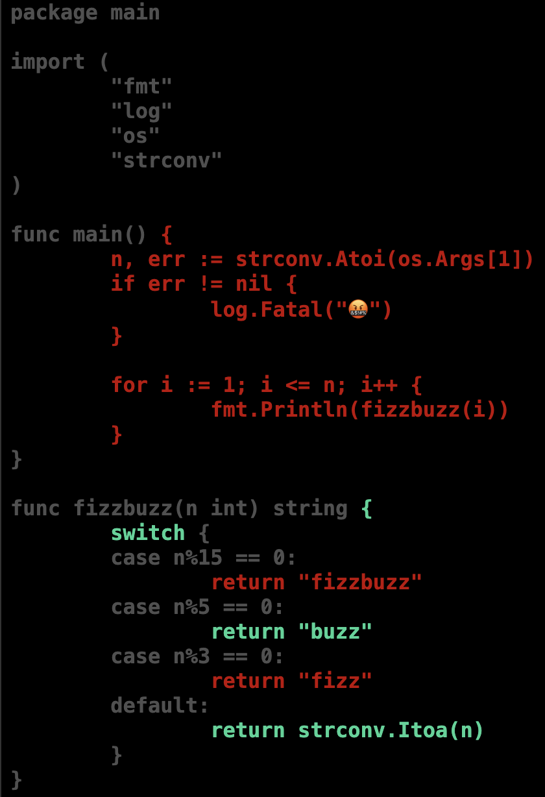

[.quote: alignment(right),text-scale(0.65)]
> `'go tool cover -html=cover.out'`

^ and the cover tool can render this into the html i'm sure most of you have seen

^ now this is actually the legacy format.

^ as of 1.20, coverage data is dumped out to a binary blob whose formatting is internal

^ but the cover tool still renders this legacy format, and it's much easier to target

^ and i'm telling you this because our implementation is just gonna target this

^ so let's look at how this all happens

^ [1:53]

---

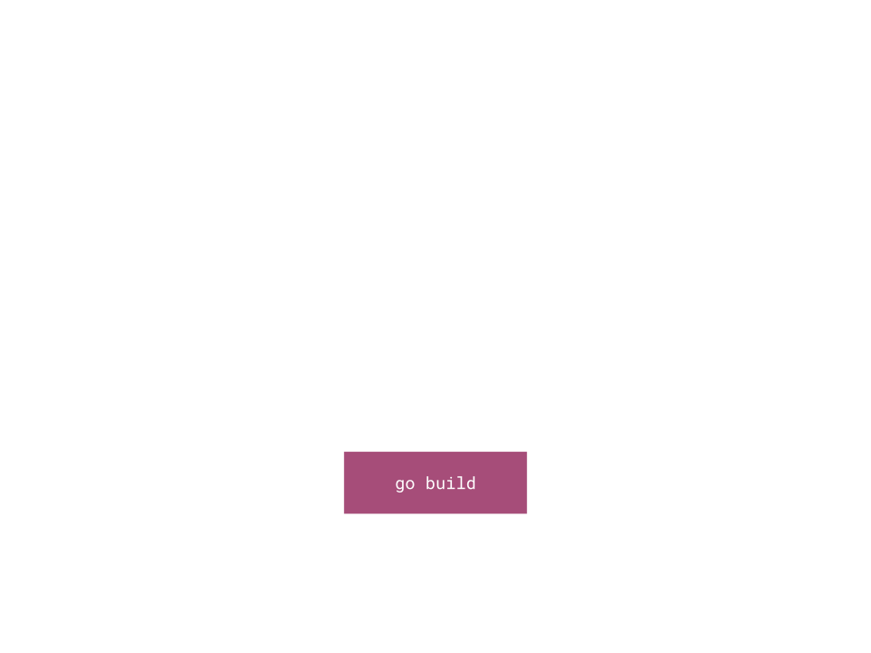

^ when you tell go to build an executable, it's gonna break that task down into a bunch of smaller actions

---

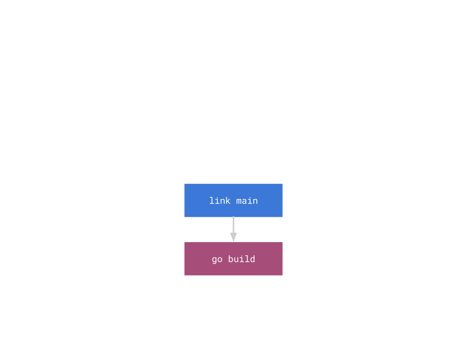

^ first, go knows it'll need to spawn the linker to create an executable

---

```
link -o $WORK/b001/exe/a.out
    -importcfg $WORK/b001/importcfg.link
    -buildmode=pie -buildid=<...> -extld=clang
    $WORK/b001/_pkg_.a
```


^ it does this by subprocessesing the link tool

---

[.code-highlight: 4]
```
link -o $WORK/b001/exe/a.out
    -importcfg $WORK/b001/importcfg.link
    -buildmode=pie -buildid=<...> -extld=clang
    $WORK/b001/_pkg_.a
```


^ the linker takes the main object file as an argument

---

[.code-highlight: 1]
```
link -o $WORK/b001/exe/a.out
    -importcfg $WORK/b001/importcfg.link
    -buildmode=pie -buildid=<...> -extld=clang
    $WORK/b001/_pkg_.a
```


^ and it outputs out an executable

^ but the linker also needs to know where to find object files for every other package in the build

^ and that comes from this importcfg.link file

---

[.code-highlight: 2]
```
link -o $WORK/b001/exe/a.out
    -importcfg $WORK/b001/importcfg.link
    -buildmode=pie -buildid=<...> -extld=clang
    $WORK/b001/_pkg_.a
```


^ and if we look inside this file,

---

[.code-highlight: 2]
```
link -o $WORK/b001/exe/a.out
    -importcfg $WORK/b001/importcfg.link
    -buildmode=pie -buildid=<...> -extld=clang
    $WORK/b001/_pkg_.a
```

[.code-highlight: 1-2,7]
```
packagefile ehden.net/fizzbuzz=$TMPDIR/go-build3163368752/b001/_pkg_.a
packagefile fmt=$TMPDIR/go-build3163368752/b002/_pkg_.a
packagefile log=$TMPDIR/go-build3163368752/b046/_pkg_.a
packagefile os=$TMPDIR/go-build3163368752/b035/_pkg_.a
packagefile strconv=$TMPDIR/go-build3163368752/b025/_pkg_.a
packagefile runtime=$TMPDIR/go-build3163368752/b009/_pkg_.a
...
```


^ ... we'll see a bunch of mappings from importpath to object file.

^ on go1.23, there are 47 packages in the build for our fizzbuzz program, and they're all gonna be listed in this file.

---


^ so continuing in reverse dependency order, the linker depends on all these object files existing, and those come from the compiler

---

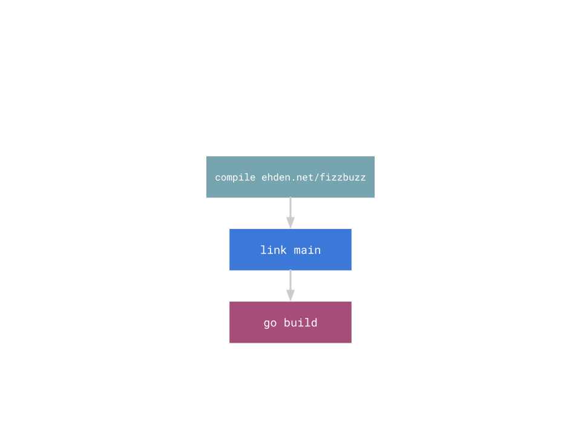

^ so, go spawns the compiler

---

[.code: text-scale(0.75), line-height(1)]
[.code-highlight: 1-2,6]
```
compile -o $WORK/b001/_pkg_.a
    -importcfg $WORK/b001/importcfg
    -trimpath "$WORK/b001=>"
    -p main -lang=go1.22 -complete -buildid <...>
    -goversion go1.22.5 -c=4 -shared -nolocalimports -pack
    ./fizzbuzz.go
```


^ the compiler takes a list of go files and spits out an object file, and there's another importcfg, but this importcfg _only contains direct dependencies of the package_

^ moving on, we also need all the packages that main depends on

---


^ so we're starting to see that this isn't a straight line, right? it's a graph

^ because main depends on fmt and log

^ but log also depends on fmt so that has to exist first, and so on.

^ this whole thing is called the action graph, but it's messy and i'm not gonna show all 47 packages like this so

---


^ i'm just gonna stick to this.

^ now that we know about the action graph, we can describe the behavior of the cover flag...

---

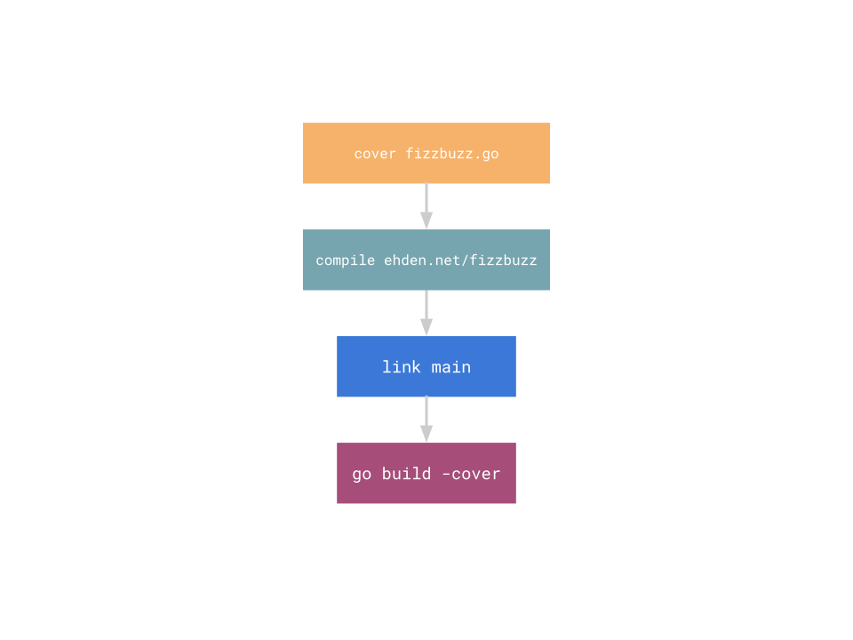

^ ... as a series of changes to this graph.

---

[.code: text-scale(0.6), line-height(1)]
```
cover -outfilelist $WORK/b001/coveroutfiles.txt
    -pkgcfg $WORK/b001/pkgcfg.txt -mode set
    -var goCover_4bac6d588efe_
    ./fizzbuzz.go
```


^ first, the cover tool takes our package's source code and throws in the instrumentation i showed earlier

---

[.code: text-scale(0.75), line-height(1)]
[.code-highlight: 3,7]

```
compile -o $WORK/b001/_pkg_.a
    -importcfg $WORK/b001/importcfg
    -coveragecfg=$WORK/b001/coveragecfg
    -trimpath "$WORK/b001=>"
    -p main -lang=go1.22 -complete -buildid <...>
    -goversion go1.22.5 -c=4 -shared -nolocalimports -pack
    $WORK/b001/fizzbuzz.cover.go $WORK/b001/covervars.go
```
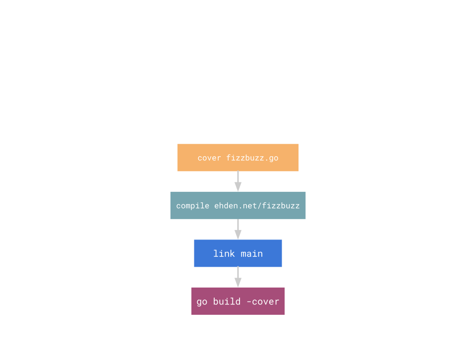

^ then the compile command is updated to take some additional coverage configuration,

^ and it's told to compile the instrumented code.

---

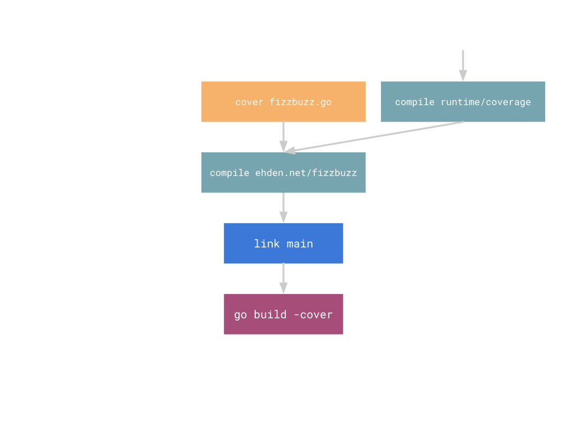

^ finally, because the instrumented code imports the runtime coverage package, that, and all of its dependencies are added to the graph

^ so that's how the built-in cover tool works.

^ and i've got like 3 minutes left to describe how we can do this ourselves, so buckle in cuz it's gonna get weird.

^ [3:45]

---

# doing this ourselves

[.code-highlight: 1-2]
```
-toolexec 'cmd args'
    a program to use to invoke toolchain programs like vet and asm.
    For example, instead of running asm, the go command will run
    'cmd args /path/to/asm <arguments for asm>'.
    The TOOLEXEC_IMPORTPATH environment variable will be set,
    matching 'go list -f {{.ImportPath}}' for the package being built.
```
[.quote: alignment(right),text-scale(0.5)]
> `'go help build'`

^ we're gonna use this flag. it's in the talk title.

^ toolexec tells go that whenever it would normally spawn a tool, it should instead spawn our program and tell us how it would have spawned that tool

---

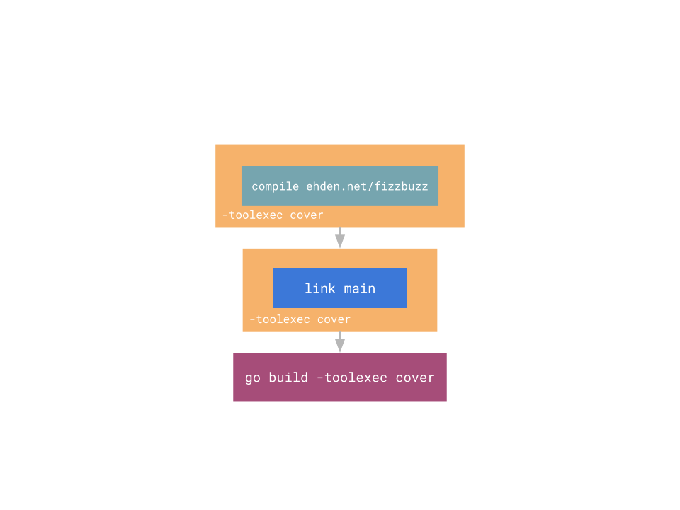

^ for example, instead of spawning the compiler directly, go will now spawn our tool and tell it how it would've spawned the compiler

^ so now it’s up to us to spawn the compiler, but before and after that, we can kinda do whatever we want

^ And we can do some really stupid stuff with this

^ we can't directly change the shape of the action graph, but we can change what happens at each node

---

[.code: text-scale(0.75), line-height(1)]
[.code-highlight: 6]

```
compile -o $WORK/b001/_pkg_.a
    -coveragecfg=$WORK/b001/coveragecfg
    -trimpath "$WORK/b001=>"
    -p main -lang=go1.22 -complete -buildid <...>
    -goversion go1.22.5 -c=4 -shared -nolocalimports -pack
    $WORK/b001/fizzbuzz.cover.go $WORK/b001/covervars.go
```

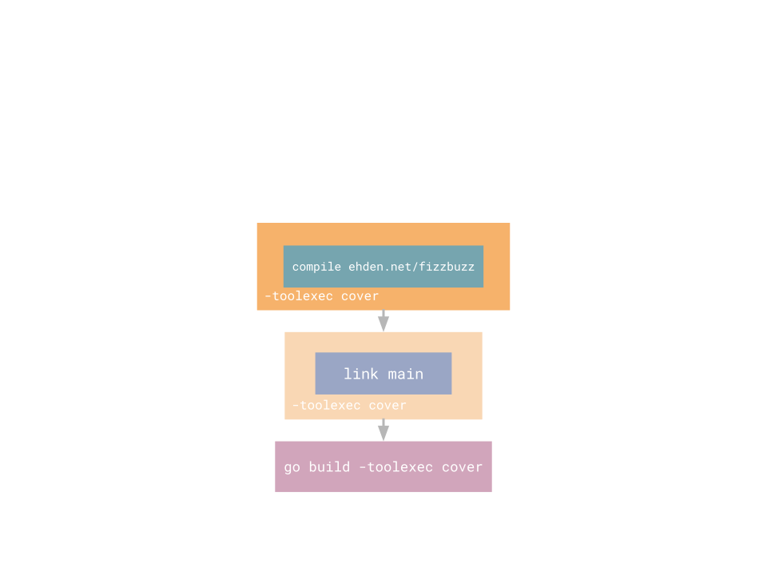

^ and this means we change which files are passed to the compiler

^ so we can add a cover variables file

^ and replace the original source with instrumented source

---

[.code: text-scale(0.75), line-height(1)]
[.code-highlight: 6]
```
compile -o $WORK/b001/_pkg_.a
    -coveragecfg=$WORK/b001/coveragecfg
    -trimpath "$WORK/b001=>"
    -p main -lang=go1.22 -complete -buildid <...>
    -goversion go1.22.5 -c=4 -shared -nolocalimports -pack
    $WORK/b001/fizzbuzz.cover.go $WORK/b001/covervars.go
```

```go
func main() {defer _WriteCoverage();
	cover_73_107();n, err := strconv.Atoi(os.Args[1])
	if err != nil {
		cover_127_144();log.Fatal("🤬")
	}
	for i := 1; i <= n; i++ {
		cover_178_202();fmt.Println(fizzbuzz(i))
	}
}

func fizzbuzz(n int) string {
	switch {
	case n%15 == 0:
		cover_268_285();return "fizzbuzz"
	case n%5 == 0:
		cover_304_317();return "buzz"
	case n%3 == 0:
		cover_336_349();return "fizz"
	default:
		cover_362_384();return strconv.Itoa(n)
	}
}
```

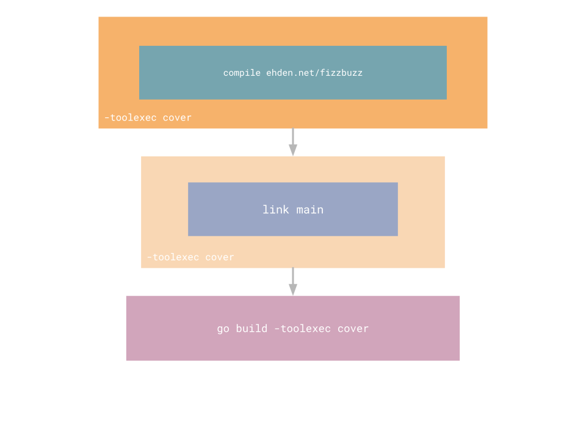

^ now i have to walk through the instrumented source, since it's a little different from what the cover tool does.

^ first,

---

[.code: text-scale(0.75), line-height(1)]
[.code-highlight: 6]
```
compile -o $WORK/b001/_pkg_.a
    -coveragecfg=$WORK/b001/coveragecfg
    -trimpath "$WORK/b001=>"
    -p main -lang=go1.22 -complete -buildid <...>
    -goversion go1.22.5 -c=4 -shared -nolocalimports -pack
    $WORK/b001/fizzbuzz.cover.go $WORK/b001/covervars.go
```

[.code-highlight: 2,4,7,14,16,18,20]
```go
func main() {defer _WriteCoverage();
	cover_73_107();n, err := strconv.Atoi(os.Args[1])
	if err != nil {
		cover_127_144();log.Fatal("🤬")
	}
	for i := 1; i <= n; i++ {
		cover_178_202();fmt.Println(fizzbuzz(i))
	}
}

func fizzbuzz(n int) string {
	switch {
	case n%15 == 0:
		cover_268_285();return "fizzbuzz"
	case n%5 == 0:
		cover_304_317();return "buzz"
	case n%3 == 0:
		cover_336_349();return "fizz"
	default:
		cover_362_384();return strconv.Itoa(n)
	}
}
```


^ i'm not clever enough to do that weird array offset variable thing

^ so i'm just generating a bunch of variables and they're being set by function calls.

---

[.code: text-scale(0.75), line-height(1)]
[.code-highlight: 6]
```
compile -o $WORK/b001/_pkg_.a
    -coveragecfg=$WORK/b001/coveragecfg
    -trimpath "$WORK/b001=>"
    -p main -lang=go1.22 -complete -buildid <...>
    -goversion go1.22.5 -c=4 -shared -nolocalimports -pack
    $WORK/b001/fizzbuzz.cover.go $WORK/b001/covervars.go
```

[.code-highlight: 1]
```go
func main() {defer _WriteCoverage();
	cover_73_107();n, err := strconv.Atoi(os.Args[1])
	if err != nil {
		cover_127_144();log.Fatal("🤬")
	}
	for i := 1; i <= n; i++ {
		cover_178_202();fmt.Println(fizzbuzz(i))
	}
}

func fizzbuzz(n int) string {
	switch {
	case n%15 == 0:
		cover_268_285();return "fizzbuzz"
	case n%5 == 0:
		cover_304_317();return "buzz"
	case n%3 == 0:
		cover_336_349();return "fizz"
	default:
		cover_362_384();return strconv.Itoa(n)
	}
}
```


^ second, i don't have a magic compiler init and i don't have access to the exit hooks that stuff is using because those APIs are all internal,

^ so i'm just dumping counter state from a deferred function in main.

---

[.code: text-scale(0.75), line-height(1)]
```
$WORK/b001/covervars.go
```

```go
package main

import _ "unsafe"

//go:linkname cover_73_107 ehden.net/cover/vars.cover_73_107_XRA0BjRi2VWNrDxFsPct
//go:linkname cover_127_144 ehden.net/cover/vars.cover_127_144_XRA0BjRi2VWNrDxFsPct
//go:linkname cover_178_202 ehden.net/cover/vars.cover_178_202_XRA0BjRi2VWNrDxFsPct
//go:linkname cover_268_285 ehden.net/cover/vars.cover_268_285_XRA0BjRi2VWNrDxFsPct
//go:linkname cover_304_317 ehden.net/cover/vars.cover_304_317_XRA0BjRi2VWNrDxFsPct
//go:linkname cover_336_349 ehden.net/cover/vars.cover_336_349_XRA0BjRi2VWNrDxFsPct
//go:linkname cover_362_384 ehden.net/cover/vars.cover_362_384_XRA0BjRi2VWNrDxFsPct

// ehden.net/fizzbuzz/fizzbuzz.go:11.2,11.36
func cover_73_107()
// ehden.net/fizzbuzz/fizzbuzz.go:13.3,13.20
func cover_127_144()
// ehden.net/fizzbuzz/fizzbuzz.go:17.3,17.27
func cover_178_202()
// ehden.net/fizzbuzz/fizzbuzz.go:24.3,24.20
func cover_268_285()
// ehden.net/fizzbuzz/fizzbuzz.go:26.3,26.16
func cover_304_317()
// ehden.net/fizzbuzz/fizzbuzz.go:28.3,28.16
func cover_336_349()
// ehden.net/fizzbuzz/fizzbuzz.go:30.3,30.25
func cover_362_384()

//go:linkname _WriteCoverage ehden.net/cover/vars.WriteCoverage
func _WriteCoverage()
```


^ finally, the definition file doesn't really have any definitions in it.

^ it's just a bunch of stubs with linkname directives

^ which tell the linker to wire all these symbols up to code defined in a different package.

^ here's what that package is gonna look like.

---

[.code-highlight: 6-9]
```go
package vars

import _ "unsafe"
import "os"

//go:linkname cover_73_107_XRA0BjRi2VWNrDxFsPct ehden.net/cover/vars.cover_73_107_XRA0BjRi2VWNrDxFsPct
//go:linkname cover_127_144_XRA0BjRi2VWNrDxFsPct ehden.net/cover/vars.cover_127_144_XRA0BjRi2VWNrDxFsPct
//go:linkname cover_178_202_XRA0BjRi2VWNrDxFsPct ehden.net/cover/vars.cover_178_202_XRA0BjRi2VWNrDxFsPct
// ...

// ehden.net/fizzbuzz/fizzbuzz.go:11.2,11.36
var _cover_73_107_XRA0BjRi2VWNrDxFsPct uint8
func cover_73_107_XRA0BjRi2VWNrDxFsPct() { _cover_73_107_XRA0BjRi2VWNrDxFsPct = 1 }

var _cover_127_144_XRA0BjRi2VWNrDxFsPct uint8
func cover_127_144_XRA0BjRi2VWNrDxFsPct() { _cover_127_144_XRA0BjRi2VWNrDxFsPct = 1 }

var _cover_178_202_XRA0BjRi2VWNrDxFsPct uint8
func cover_178_202_XRA0BjRi2VWNrDxFsPct() { _cover_178_202_XRA0BjRi2VWNrDxFsPct = 1 }

// ...

func WriteCoverage() {
	outPath := "cover.out"
	f, _ := os.Create(outPath)
	defer f.Close()

	f.WriteString("mode: set\n")
	f.WriteString("ehden.net/fizzbuzz/fizzbuzz.go:11.2,11.36" + " 1 " + stringFor(_cover_73_107_XRA0BjRi2VWNrDxFsPct) + "\n")
	f.WriteString("ehden.net/fizzbuzz/fizzbuzz.go:13.3,13.20" + " 1 " + stringFor(_cover_127_144_XRA0BjRi2VWNrDxFsPct) + "\n")
    // ...
}
```

^ it has a bunch of linknames

---

[.code-highlight: 12-21]
```go
package vars

import _ "unsafe"
import "os"

//go:linkname cover_73_107_XRA0BjRi2VWNrDxFsPct ehden.net/cover/vars.cover_73_107_XRA0BjRi2VWNrDxFsPct
//go:linkname cover_127_144_XRA0BjRi2VWNrDxFsPct ehden.net/cover/vars.cover_127_144_XRA0BjRi2VWNrDxFsPct
//go:linkname cover_178_202_XRA0BjRi2VWNrDxFsPct ehden.net/cover/vars.cover_178_202_XRA0BjRi2VWNrDxFsPct
// ...

// ehden.net/fizzbuzz/fizzbuzz.go:11.2,11.36
var _cover_73_107_XRA0BjRi2VWNrDxFsPct uint8
func cover_73_107_XRA0BjRi2VWNrDxFsPct() { _cover_73_107_XRA0BjRi2VWNrDxFsPct = 1 }

var _cover_127_144_XRA0BjRi2VWNrDxFsPct uint8
func cover_127_144_XRA0BjRi2VWNrDxFsPct() { _cover_127_144_XRA0BjRi2VWNrDxFsPct = 1 }

var _cover_178_202_XRA0BjRi2VWNrDxFsPct uint8
func cover_178_202_XRA0BjRi2VWNrDxFsPct() { _cover_178_202_XRA0BjRi2VWNrDxFsPct = 1 }

// ...

func WriteCoverage() {
	outPath := "cover.out"
	f, _ := os.Create(outPath)
	defer f.Close()

	f.WriteString("mode: set\n")
	f.WriteString("ehden.net/fizzbuzz/fizzbuzz.go:11.2,11.36" + " 1 " + stringFor(_cover_73_107_XRA0BjRi2VWNrDxFsPct) + "\n")
	f.WriteString("ehden.net/fizzbuzz/fizzbuzz.go:13.3,13.20" + " 1 " + stringFor(_cover_127_144_XRA0BjRi2VWNrDxFsPct) + "\n")
    // ...
}
```

^ ... and then it has the variables and the functions which set them

---

[.code-highlight: 23-32]
```go
package vars

import _ "unsafe"
import "os"

//go:linkname cover_73_107_XRA0BjRi2VWNrDxFsPct ehden.net/cover/vars.cover_73_107_XRA0BjRi2VWNrDxFsPct
//go:linkname cover_127_144_XRA0BjRi2VWNrDxFsPct ehden.net/cover/vars.cover_127_144_XRA0BjRi2VWNrDxFsPct
//go:linkname cover_178_202_XRA0BjRi2VWNrDxFsPct ehden.net/cover/vars.cover_178_202_XRA0BjRi2VWNrDxFsPct
// ...

// ehden.net/fizzbuzz/fizzbuzz.go:11.2,11.36
var _cover_73_107_XRA0BjRi2VWNrDxFsPct uint8
func cover_73_107_XRA0BjRi2VWNrDxFsPct() { _cover_73_107_XRA0BjRi2VWNrDxFsPct = 1 }

var _cover_127_144_XRA0BjRi2VWNrDxFsPct uint8
func cover_127_144_XRA0BjRi2VWNrDxFsPct() { _cover_127_144_XRA0BjRi2VWNrDxFsPct = 1 }

var _cover_178_202_XRA0BjRi2VWNrDxFsPct uint8
func cover_178_202_XRA0BjRi2VWNrDxFsPct() { _cover_178_202_XRA0BjRi2VWNrDxFsPct = 1 }

// ...

func WriteCoverage() {
	outPath := "cover.out"
	f, _ := os.Create(outPath)
	defer f.Close()

	f.WriteString("mode: set\n")
	f.WriteString("ehden.net/fizzbuzz/fizzbuzz.go:11.2,11.36" + " 1 " + stringFor(_cover_73_107_XRA0BjRi2VWNrDxFsPct) + "\n")
	f.WriteString("ehden.net/fizzbuzz/fizzbuzz.go:13.3,13.20" + " 1 " + stringFor(_cover_127_144_XRA0BjRi2VWNrDxFsPct) + "\n")
    // ...
}
```

^ and lastly it's got the function deferred by main, which prints the value of all those variables to a file.

^ ... but I'm getting ahead of myself because this file can't exist yet... so here's the problem.

---

# problem

- we need to compile this package somehow

^ we need to generate this package and compile it ourselves since we're still working within the confines of the existing action graph

---

# problem

- we need to compile this package somehow
    - ... into main

^ but we need to compile this package _into main_ because none of the linkname directives work if these function definitions don't exist somewhere already.

---

# problem

- we need to compile this package somehow
    - ... into main
        - but it needs to be compiled after main
        - ... woops

^ except that we can't really generate the function definitions until after main is compiled because we might want to instrument any of the other 46 packages in the build and that means we that in order to generate our code we need to know about all of the packages in the build.

^ ... and only the linker gets this info.

^ so here's the plan.

---

# ~~the plan~~ hold my beer

[.code: text-scale(0.5), line-height(1)]
1. cache block info while we compile each package

^ in each compile action, we'll do our instrumentation

^ but we'll also write block info to a cache so we can use it later

^ the cache is keyed on an ID we can pull from the object file

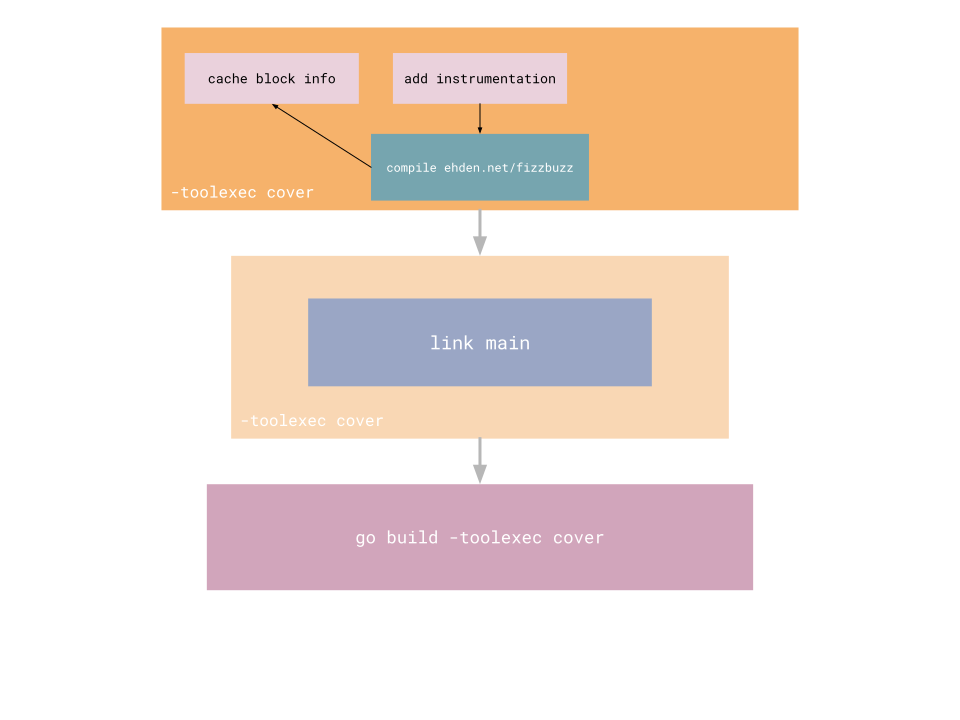

---

# ~~the plan~~ hold my beer

[.code: text-scale(0.5), line-height(1)]
1. cache block info while we compile each package
1. generate package code with importcfg.link

^ then we're gonna generate our variables package by iterating the linker's importcfg

^ and using its entries to do cache lookups

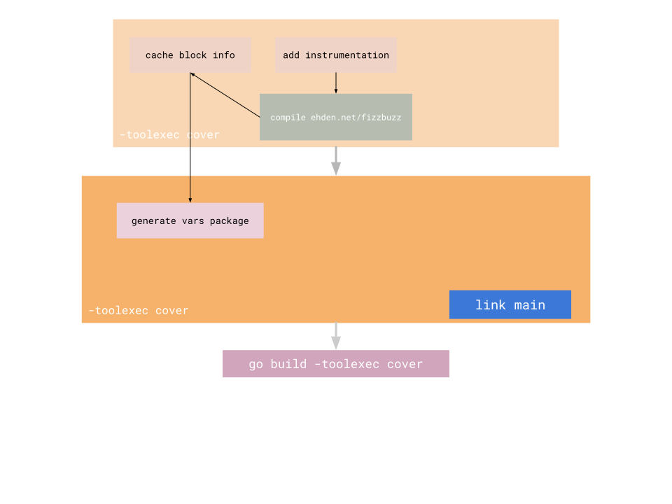

---

# ~~the plan~~ hold my beer

[.code: text-scale(0.5), line-height(1)]
1. cache block info while we compile each package
1. generate package code with importcfg.link
1. build our generated package
    ```
    go list -toolexec cover -export -f {{ .Export }}
    ```

^ then we're gonna build our generated package with go list

^ the export flag tells go we need an object file

^ but we also need to use the toolexec flag again so that we can do some importcfg patching i don't have time to explain

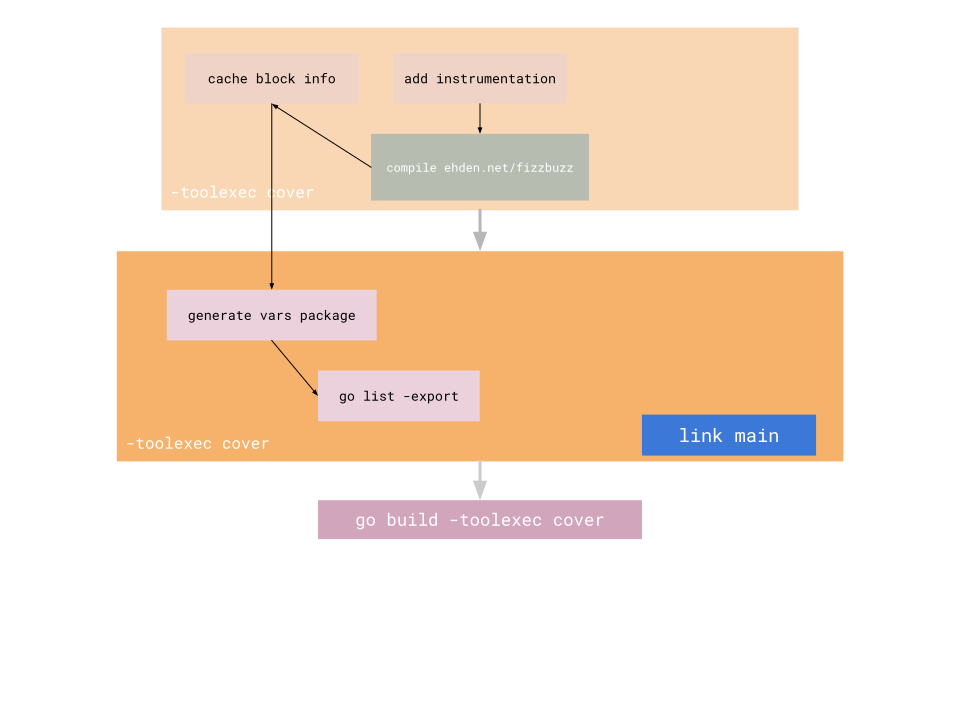

---

# ~~the plan~~ hold my beer

[.code: text-scale(0.5), line-height(1)]
1. cache block info while we compile each package
1. generate package code with importcfg.link
1. build our generated package
    ```
    go list -toolexec cover -export -f {{ .Export }}
    ```
1. recompile main so it imports generated package

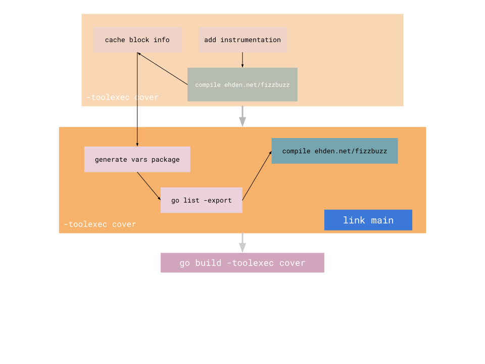

^ then we're gonna recompile main

^ but this time it's gonna import our made up package

---

# ~~the plan~~ hold my beer

[.code: text-scale(0.5), line-height(1)]
1. cache block info while we compile each package
1. generate package code with importcfg.link
1. build our generated package
    ```
    go list -toolexec cover -export -f {{ .Export }}
    ```
1. recompile main so it imports generated package
1. import linker's importcfg to include new packages

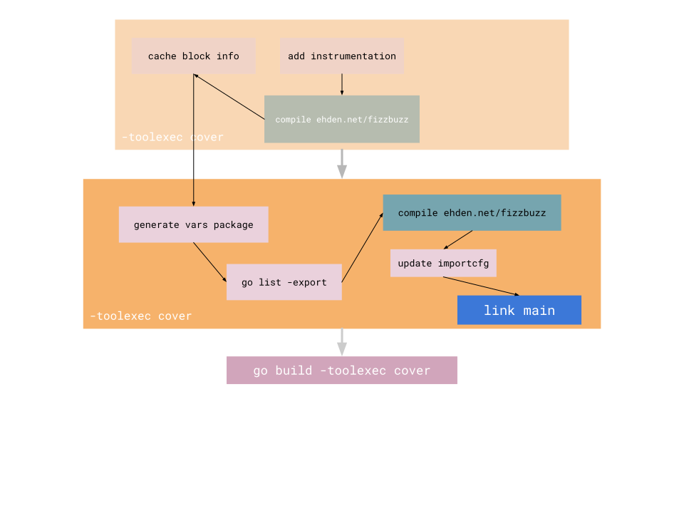

^ finally, we need to update the linker's importcfg so it points to our generated package and the new main

---

# ~~the plan~~ hold my beer

[.code: text-scale(0.5), line-height(1)]
1. cache block info while we compile each package
1. generate package code with importcfg.link
1. build our generated package
    ```
    go list -toolexec cover -export -f {{ .Export }}
    ```
1. recompile main so it imports generated package
1. import linker's importcfg to include new packages
1. quiet contemplation


^ finally, we need to update the linker's importcfg so it points to our generated package and the new main

^ ... and that mostly works.

---

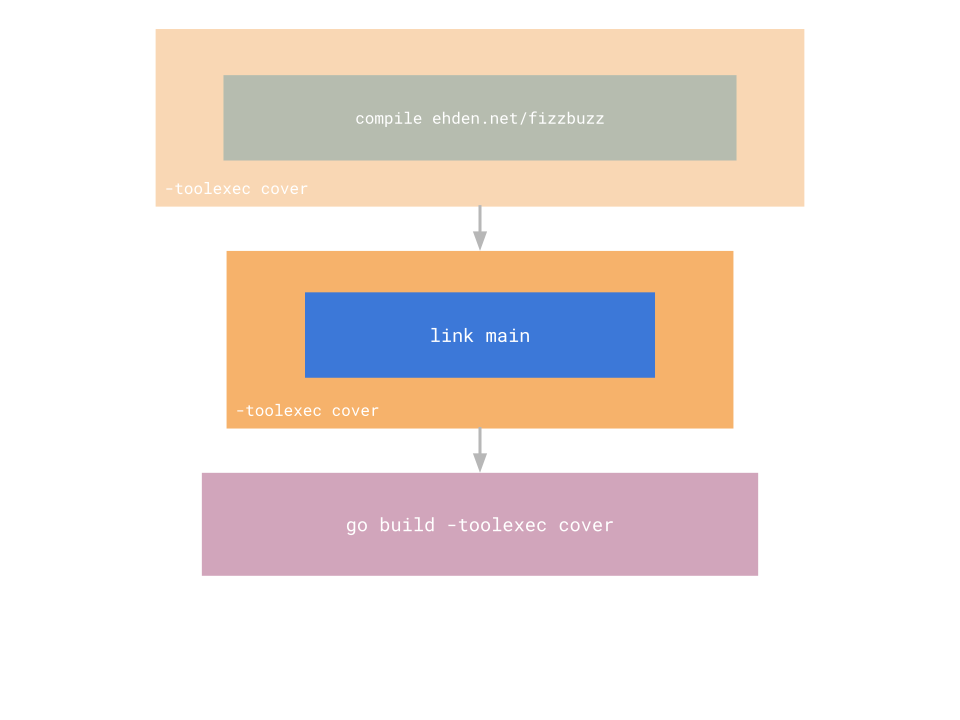

---

# please talk to me

_email_: ehdens@gmail.com

_gophers slack_: @ehden

_discord_: cixel

### 

[.quote: alignment(right),text-scale(1)]
> talk materials and code available at
> github.com/cixel/gc2024

